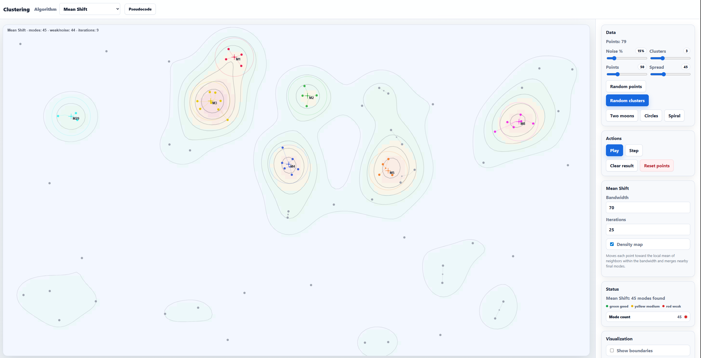
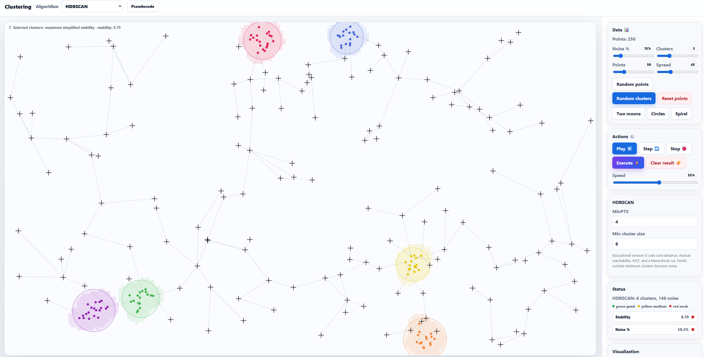
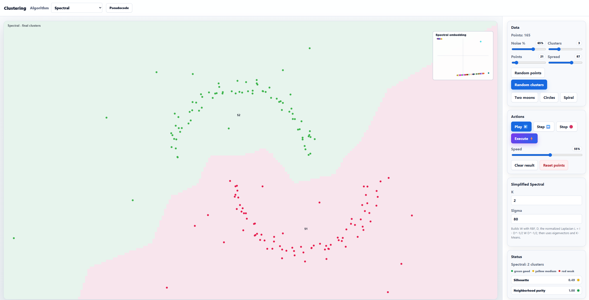
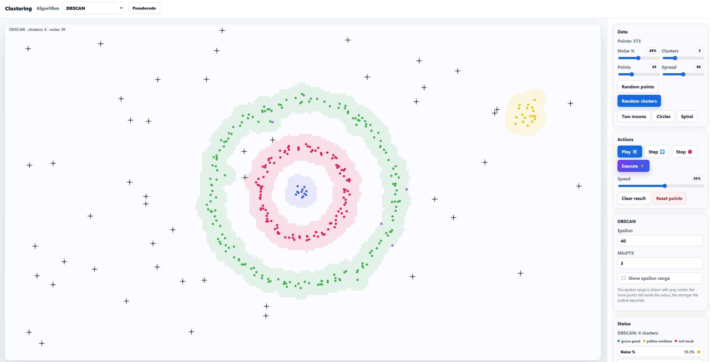
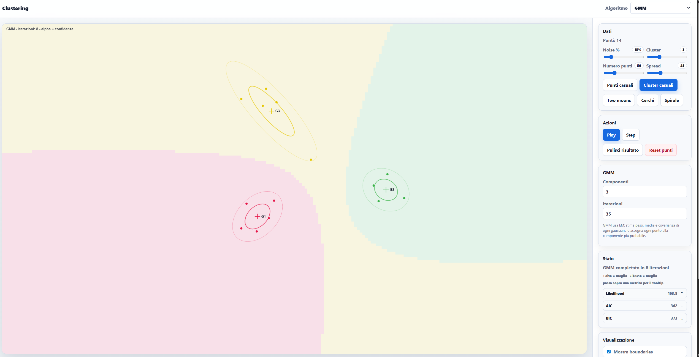
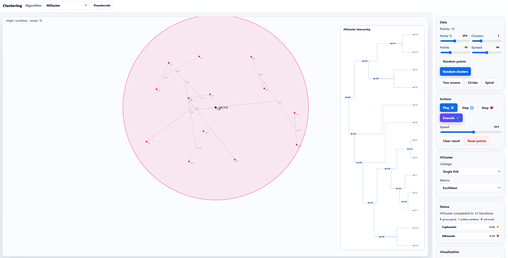
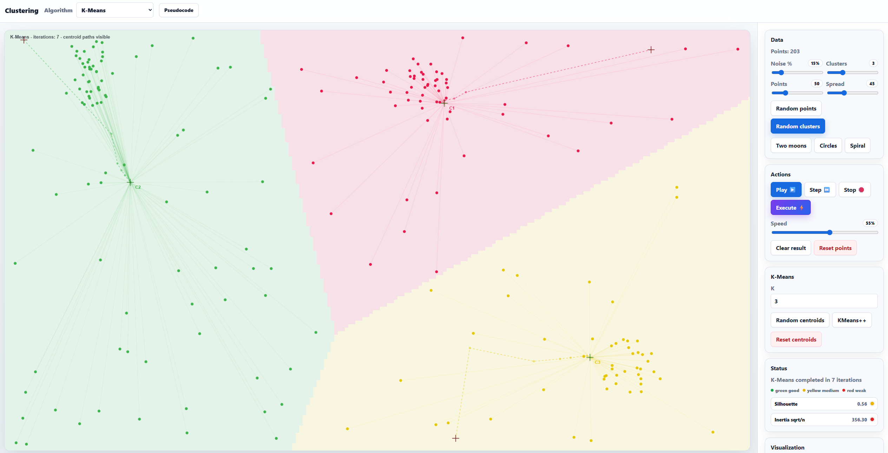
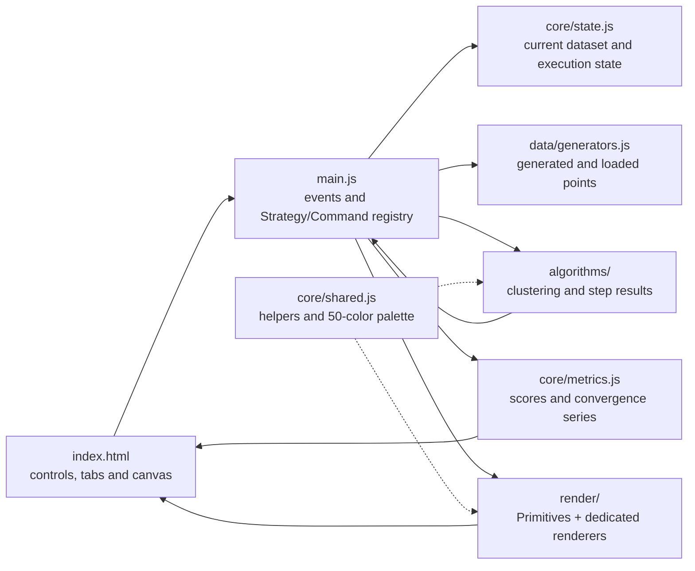

# Clustering Playground

Interactive playground to visualize and experiment with clustering algorithms directly in the browser.

Built with vanilla JavaScript and HTML5 Canvas.

---

# Online Demo 🎮

👉 [Try live demo](https://marcomariani98.github.io/clustering-playground/) 👈

The project can be run directly in the browser through GitHub Pages.

---

# Overview

This project is an educational and visual tool for exploring how the main clustering algorithms behave on synthetic datasets generated in real time.

The project intentionally avoids external libraries and keeps the implementation in vanilla JavaScript.

It is a personal project developed and improved progressively over about 3 years, with ups and downs, through continuous experimentation, study of clustering algorithms, and many iterations on the visual and educational experience. The project originally started as a separate university exam project built with Node.js. Later, I revisited the idea and tried to turn it into a single-file version, which is how the first commits of this repository were made. After about a week, I split the logic again into smaller modules to improve readability, maintainability, and the internal structure, bringing it closer to the original spirit of the project, while still preserving the initial philosophy of keeping it dependency-free, without Node.js or external libraries. In a way, the circle is now complete.

The application lets you:

- generate interactive datasets
- paint custom datasets with the brush tool (1:1 mapping: slider value = points spawned per stroke tick)
- export and reload point clouds as JSON
- run different clustering algorithms
- execute algorithms instantly
- play animated algorithm steps
- move step by step through intermediate states
- stop an active animation at any time
- control the animation speed
- observe boundaries and decision regions
- inspect metrics, convergence curves, and a model comparison table for GMM
- read the current algorithm's worst-case complexity at a glance (big-O badge in the top bar)
- opt out of the per-algorithm safety guard when you want to push the dataset further
- switch between light and dark themes
- compare centroid-based, density-based, and structure-based approaches
- understand intuitively how results change when parameters change

The main goal is educational and visual, not scientific performance or production-ready usage.

---

## Visualizations

### Mean Shift


### HDBSCAN


### Spectral Clustering


### DBSCAN


### Gaussian Mixture Models


### Hierarchical Clustering


### K-Means


---

# Features

## Dataset Generation

Available datasets:

- Random clusters
- Random noise
- Two Moons
- Concentric circles
- Spiral

Adjustable parameters:

- number of points
- spread
- noise percentage
- number of clusters

## Custom Datasets

Besides the standard generators, **Brush mode** lets you paint points directly on the canvas by dragging the mouse. The `Points` slider maps **1:1** to the number of points spawned per tick (slider = 1 paints one point at a time, slider = 50 paints 50, up to 200). The `Spread` controls the brush radius and `Noise %` adds extra jitter — same controls as the generators, applied directly to the stroke.

The `Save / Load` tab exports the current point cloud to JSON and reloads it later, so hand-drawn datasets can be reused.

---

# Execution Controls

The playground includes four main execution modes designed to make the algorithms easier to explore:

- **Play ▶️**: runs the selected algorithm as an animation, showing its intermediate steps over time.
- **Step ⏭️**: advances the selected algorithm by one step, useful for understanding each phase slowly.
- **Stop 🛑**: stops the current animated execution without clearing the dataset.
- **Execute ⚡**: runs the selected algorithm immediately and shows the final result.

A speed slider controls how fast the animated execution runs during Play mode.

---

# Top Bar

The top bar always shows three pieces of context next to the algorithm picker:

- **Status pill** — a live diagnostic line (`Ready`, `Points: 42`, `K-Means completed in 12 iterations`, …). Replaces the old `Status` section in the sidebar; the sidebar block is now called **Metrics**.
- **Complexity badge** — the worst-case time complexity for the selected algorithm, color-coded by severity:
  - 🟦 light: `O(n·k·i)` for K-Means, Fuzzy C-Means, GMM
  - 🟨 medium: `O(n²)` / `O(n²·i)` for DBSCAN, HDBSCAN, Mean Shift
  - 🟥 heavy: `O(n³)` for Spectral and Hierarchical Clustering
- **Safe mode toggle** — on by default. Caps how many points each algorithm is allowed to consume before the browser freezes (e.g. Spectral 180, HCluster 30, K-Means 2000). Turn it off to push past the limits at your own risk.

---

# Mouse Interaction

The application also supports manual insertion of initial centroids.

## Mouse Controls

- Left click -> adds a point on the canvas
- Right click -> adds a manual centroid on the canvas in K-Means mode
- Manual centroids can be used by centroid-based algorithms such as K-Means

This mode lets you observe how the initial centroid choice affects the final clustering result.

---

# Implemented Algorithms

## Classic / Soft Clustering

- **K-Means** — with four selectable centroid-initialization strategies:
  - **Random (canvas)** — uniform positions in the canvas
  - **Forgy (1965)** — k points sampled uniformly from the dataset
  - **K-Means++ (Arthur & Vassilvitskii 2007)** — probabilistic D² weighted sampling
  - **Farthest-First (Gonzalez 1985)** — deterministic max-min distance (the original "kpp" button, now correctly labeled)
- **Fuzzy C-Means**
- **Gaussian Mixture Models (GMM)** — with model-comparison table across reruns (AIC, BIC, agreement verdict), traffic-light coloring on Fit / point, AIC and BIC

## Density-Based Clustering

- DBSCAN — epsilon parameter changes clear the previous result so the drawn radii always match the input value
- HDBSCAN
- Mean Shift

## Structure-Based Clustering

- **Spectral Clustering** — five selectable graph Laplacians:
  - **Symmetric normalized** `L_sym = I − D^−1/2 W D^−1/2` (Ng-Jordan-Weiss 2002, default)
  - **Unnormalized** `L = D − W` (textbook combinatorial)
  - **Random walk** `L_rw = I − D^−1 W` (Shi-Malik 2000, normalized cut)
  - **Signless** `Q = D + W` (bipartiteness detection; educational)
  - **Bethe Hessian** `H_β = (β²−1)I + D − βW` (Saade-Krzakala-Zdeborová 2014, with β ≈ √(mean degree))
- **Hierarchical Clustering** — the dendrogram now grows directly on the main canvas as merges happen, instead of living in a sidebar preview. A yellow marker highlights the most recent merge at every step.

---

# Visualizations

The project includes several visualizations designed to make the algorithms easier to understand:

- persistent light/dark theme
- animated Play mode
- step-by-step execution
- instant Execute mode
- stoppable algorithm animations
- adjustable animation speed
- traffic-light quality metrics with explanatory hints — every card explains *why* it is good or bad, and the threshold that flipped its color
- real-time convergence sparklines for K-Means, GMM, and Fuzzy C-Means
- Voronoi-style boundaries for K-Means
- four selectable K-Means centroid initializations (Random, Forgy, K-Means++, Farthest-First)
- convergence trails for Mean Shift
- density contour map for Mean Shift
- epsilon ranges for DBSCAN, with the actual `eps=N` value drawn next to the visited point and stale circles cleared automatically when the parameter changes
- density regions
- Gaussian ellipses for GMM
- GMM confidence metrics, AIC/BIC ranking table, and verdict line ("Agreed: k=N wins on both" when AIC and BIC concur)
- five selectable graph Laplacians for Spectral Clustering (Symmetric, Unnormalized, Random walk, Signless, Bethe Hessian)
- sidebar affinity heatmap for Spectral Clustering
- Minimum Spanning Tree
- animated dendrogram drawn on the main canvas during Hierarchical Clustering, with a marker on the latest merge
- membership-based transparency for fuzzy methods

---

# Technologies

- Vanilla JavaScript
- HTML5 Canvas
- HTML/CSS
- No external framework

---

# Project Structure

The app stays dependency-free, but the code is divided by responsibility instead of living in one large file.

```text
src/
  algorithms/  clustering calculations and algorithm steps
  core/        AppState, Metrics, palette and shared utilities
  data/        dataset generators
  render/      Primitives and algorithm-specific renderers
  main.js      UI coordination, execution flow and startup
```

Scripts are loaded in dependency order from `index.html`, so the playground still works when opened directly without a development server.

## How The Pieces Work Together



`index.html` contains the controls, sidebar panels, and canvas. `main.js` coordinates user actions, asks the selected algorithm for results or animation steps, and passes those results to the matching renderer. `AppState` holds the live session state; `Metrics` computes score cards, the GMM model-comparison ranking, and sparkline data; `Primitives` centralizes shared canvas drawing while each renderer is responsible for the visual language of one algorithm.

The top bar keeps three things always visible: the live diagnostic status pill, the current algorithm's big-O complexity badge, and the safe-mode toggle that enforces per-algorithm point limits. The sidebar is the learning panel: it keeps metric cards visible, plots convergence for iterative algorithms, and shows the Spectral affinity heatmap. HCluster's dendrogram now lives directly on the main canvas (no more sidebar preview) and grows in step with the algorithm.

## Design Patterns

`main.js` uses a small **Strategy** registry: every clustering mode exposes a `run` action and a `draw` action, so the application can switch algorithms without putting all behavior in one controller branch.

The `run` actions also act like lightweight **Commands**: buttons such as Play, Step and Execute invoke the selected behavior through the same entry point, while each algorithm remains focused on its own calculations. A single `safeRun(algorithm)` guard fronts every command and refuses to start when the dataset would freeze the browser — the per-algorithm thresholds are documented as a complexity table right above the function.

The render layer follows a simple shared-base approach: `Primitives` provides reusable canvas operations and theme-aware colors, while dedicated renderer classes compose them for K-Means, DBSCAN, GMM, Spectral, and the other algorithms.

`Metrics` is an **IIFE module** that exposes only `computeMetrics` and `convergenceSeries` — every helper (silhouette, Davies-Bouldin, GMM responsibilities, cross-run AIC/BIC ranking, convergence quality scoring) stays private inside it.

---

# Educational Goal

This project is meant to help visualize concepts that are often hard to understand through static images or pure theory.

The goal is not to provide optimized implementations of the algorithms, but to make their behavior observable and intuitive.

Some algorithms are intentionally simplified or adapted for visual and educational purposes.

---

# Local Start

Just open:

```html
index.html
```
