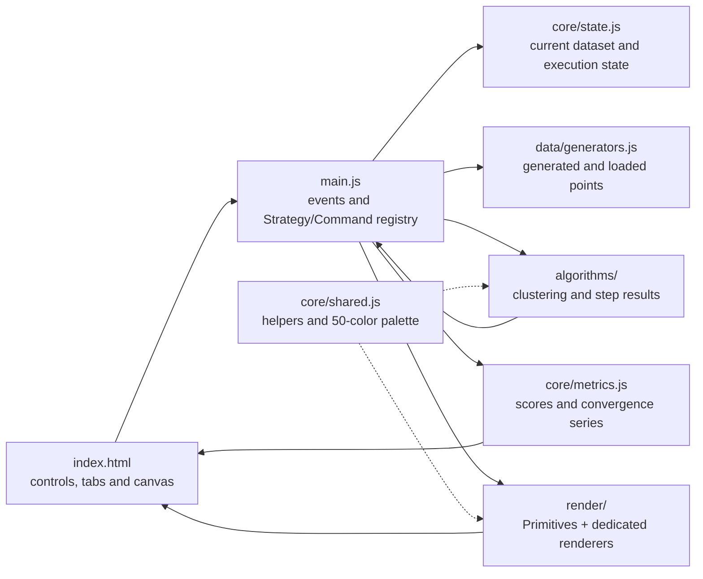

# Clustering Playground

Interactive playground to visualize and experiment with clustering algorithms directly in the browser.

Built with vanilla JavaScript and HTML5 Canvas.

---

# Overview

This project is an educational and visual tool for exploring how the main clustering algorithms behave on synthetic datasets generated in real time.

The project intentionally avoids external libraries and keeps the implementation in vanilla JavaScript.

It is a personal project developed and improved progressively over about 3 years, with ups and downs, through continuous experimentation, study of clustering algorithms, and many iterations on the visual and educational experience.

The application lets you:

- generate interactive datasets
- paint custom datasets with the brush tool
- export and reload point clouds as JSON
- run different clustering algorithms
- execute algorithms instantly
- play animated algorithm steps
- move step by step through intermediate states
- stop an active animation at any time
- control the animation speed
- observe boundaries and decision regions
- inspect metrics, convergence curves, and algorithm-specific previews
- switch between light and dark themes
- compare centroid-based, density-based, and structure-based approaches
- understand intuitively how results change when parameters change

The main goal is educational and visual, not scientific performance or production-ready usage.

---

# Online Demo 🎮

👉 [Try live demo](https://marcomariani98.github.io/clustering-playground/) 👈

The project can be run directly in the browser through GitHub Pages.

---

## Visualizations

### Mean Shift


### HDBSCAN


### Spectral Clustering


### DBSCAN


### Gaussian Mixture Models


### Hierarchical Clustering


### K-Means


---

# Features

## Dataset Generation

Available datasets:

- Random clusters
- Random noise
- Two Moons
- Concentric circles
- Spiral

Adjustable parameters:

- number of points
- spread
- noise percentage
- number of clusters

## Custom Datasets

Besides the standard generators, **Brush mode** lets you paint points directly on the canvas by dragging the mouse. Its density, spread, and jitter follow the same `Points`, `Spread`, and `Noise %` controls used by generated datasets.

The `Save / Load` tab exports the current point cloud to JSON and reloads it later, so hand-drawn datasets can be reused.

---

# Execution Controls

The playground includes four main execution modes designed to make the algorithms easier to explore:

- **Play ▶️**: runs the selected algorithm as an animation, showing its intermediate steps over time.
- **Step ⏭️**: advances the selected algorithm by one step, useful for understanding each phase slowly.
- **Stop 🛑**: stops the current animated execution without clearing the dataset.
- **Execute ⚡**: runs the selected algorithm immediately and shows the final result.

A speed slider controls how fast the animated execution runs during Play mode.

---

# Mouse Interaction

The application also supports manual insertion of initial centroids.

## Mouse Controls

- Left click -> adds a point on the canvas
- Right click -> adds a manual centroid on the canvas in K-Means mode
- Manual centroids can be used by centroid-based algorithms such as K-Means

This mode lets you observe how the initial centroid choice affects the final clustering result.

---

# Implemented Algorithms

## Classic / Soft Clustering

- K-Means
- Fuzzy C-Means
- Gaussian Mixture Models (GMM)

## Density-Based Clustering

- DBSCAN
- HDBSCAN
- Mean Shift

## Structure-Based Clustering

- Spectral Clustering
- Hierarchical Clustering

---

# Visualizations

The project includes several visualizations designed to make the algorithms easier to understand:

- persistent light/dark theme
- animated Play mode
- step-by-step execution
- instant Execute mode
- stoppable algorithm animations
- adjustable animation speed
- quality metrics with colored indicators and explanatory hints
- real-time convergence sparklines for K-Means, GMM, and Fuzzy C-Means
- Voronoi-style boundaries for K-Means
- convergence trails for Mean Shift
- density contour map for Mean Shift
- epsilon ranges for DBSCAN
- density regions
- Gaussian ellipses for GMM
- GMM confidence metrics and AIC/BIC comparison across component counts
- selectable graph Laplacians for Spectral Clustering
- sidebar affinity heatmap for Spectral Clustering
- Minimum Spanning Tree
- dendrograms for hierarchical clustering
- compact sidebar dendrogram for Hierarchical Clustering
- membership-based transparency for fuzzy methods

---

# Technologies

- Vanilla JavaScript
- HTML5 Canvas
- HTML/CSS
- No external framework

---

# Project Structure

The app stays dependency-free, but the code is divided by responsibility instead of living in one large file.

```text
src/
  algorithms/  clustering calculations and algorithm steps
  core/        AppState, Metrics, palette and shared utilities
  data/        dataset generators
  render/      Primitives and algorithm-specific renderers
  main.js      UI coordination, execution flow and startup
```

Scripts are loaded in dependency order from `index.html`, so the playground still works when opened directly without a development server.

## How The Pieces Work Together



`index.html` contains the controls, sidebar panels, and canvas. `main.js` coordinates user actions, asks the selected algorithm for results or animation steps, and passes those results to the matching renderer. `AppState` holds the live session state; `Metrics` computes score cards and sparkline data; `Primitives` centralizes shared canvas drawing while each renderer is responsible for the visual language of one algorithm.

The sidebar is part of the learning flow: it keeps metrics visible, plots convergence for iterative algorithms, shows the Spectral affinity heatmap, and presents a compact HCluster dendrogram while the main canvas stays focused on the clustering result.

## Design Patterns

`main.js` uses a small **Strategy** registry: every clustering mode exposes a `run` action and a `draw` action, so the application can switch algorithms without putting all behavior in one controller branch.

The `run` actions also act like lightweight **Commands**: buttons such as Play, Step and Execute invoke the selected behavior through the same entry point, while each algorithm remains focused on its own calculations.

The render layer follows a simple shared-base approach: `Primitives` provides reusable canvas operations and theme-aware colors, while dedicated renderer classes compose them for K-Means, DBSCAN, GMM, Spectral, and the other algorithms.

---

# Educational Goal

This project is meant to help visualize concepts that are often hard to understand through static images or pure theory.

The goal is not to provide optimized implementations of the algorithms, but to make their behavior observable and intuitive.

Some algorithms are intentionally simplified or adapted for visual and educational purposes.

---

# Local Start

Just open:

```html
index.html
```
