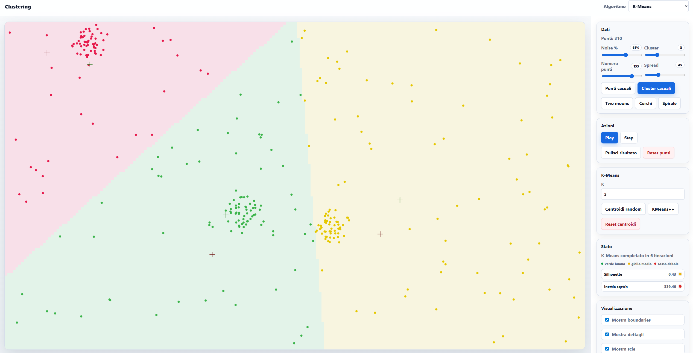

# Clustering Playground

Interactive playground to visualize and experiment with clustering algorithms directly in the browser.

Built with vanilla JavaScript and HTML5 Canvas.

---

# Overview

This project is an educational and visual tool for exploring how the main clustering algorithms behave on synthetic datasets generated in real time.

The project intentionally avoids external libraries and keeps the implementation in vanilla JavaScript.

It is a personal project developed and improved progressively over about 3 years, with ups and downs, through continuous experimentation, study of clustering algorithms, and many iterations on the visual and educational experience.

The application lets you:

- generate interactive datasets
- run different clustering algorithms
- visualize intermediate steps
- observe boundaries and decision regions
- compare centroid-based, density-based, and structure-based approaches
- understand intuitively how results change when parameters change

The main goal is educational and visual, not scientific performance or production-ready usage.

---

# Online Demo 🎮

👉 [Try live demo](https://marcomariani98.github.io/clustering-playground/) 👈

The project can be run directly in the browser through GitHub Pages.

---

## Visualizations

### Mean Shift


### HDBSCAN


### Spectral Clustering


### DBSCAN


### Gaussian Mixture Models


### Hierarchical Clustering


### K-Means


---

# Features

## Dataset Generation

Available datasets:

- Random clusters
- Random noise
- Two Moons
- Concentric circles
- Spiral

Adjustable parameters:

- number of points
- spread
- noise percentage
- number of clusters

---

# Mouse Interaction

The application also supports manual insertion of initial centroids.

## Mouse Controls

- Left click -> adds a point on the canvas
- Right click -> adds a manual centroid on the canvas in K-Means mode
- Manual centroids can be used by centroid-based algorithms such as K-Means

This mode lets you observe how the initial centroid choice affects the final clustering result.

---

# Implemented Algorithms

## Classic / Soft Clustering

- K-Means
- Fuzzy C-Means
- Gaussian Mixture Models (GMM)

## Density-Based Clustering

- DBSCAN
- HDBSCAN
- Mean Shift

## Structure-Based Clustering

- Spectral Clustering
- Hierarchical Clustering

---

# Visualizations

The project includes several visualizations designed to make the algorithms easier to understand:

- step-by-step execution
- Voronoi-style boundaries for K-Means
- convergence trails for Mean Shift
- density contour map for Mean Shift
- epsilon ranges for DBSCAN
- density regions
- Gaussian ellipses for GMM
- Minimum Spanning Tree
- dendrograms for hierarchical clustering
- membership-based transparency for fuzzy methods

---

# Technologies

- Vanilla JavaScript
- HTML5 Canvas
- HTML/CSS
- No external framework

---

# Project Structure

The current version intentionally keeps most of the logic in a single JavaScript file, so the full flow is easier to follow during educational exploration.

The main components include:

- dataset generation
- algorithm implementations
- canvas rendering
- interactive UI controls

---

# Educational Goal

This project is meant to help visualize concepts that are often hard to understand through static images or pure theory.

The goal is not to provide optimized implementations of the algorithms, but to make their behavior observable and intuitive.

Some algorithms are intentionally simplified or adapted for visual and educational purposes.

---

# Local Start

Just open:

```html
index.html
```
